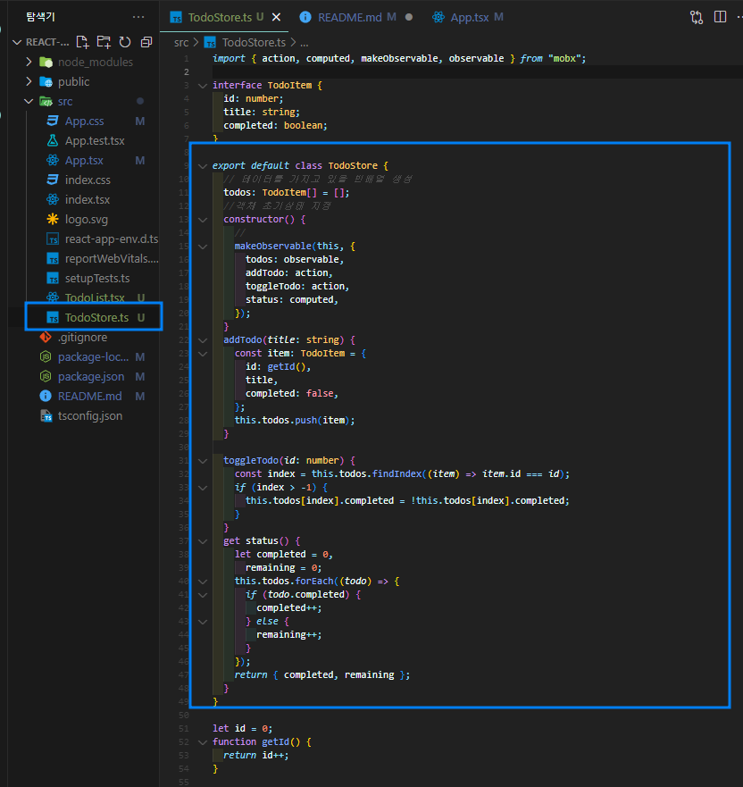
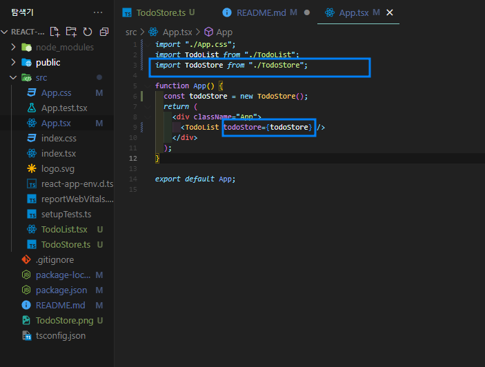
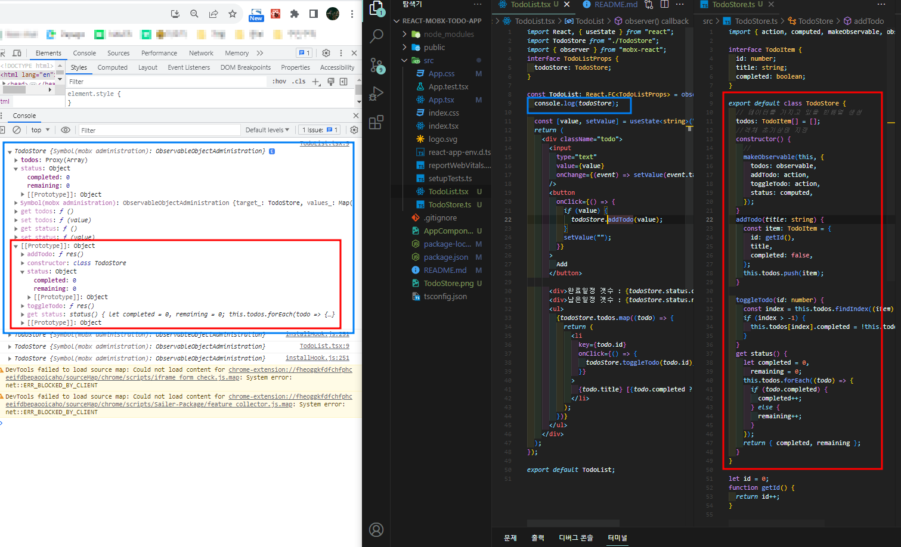
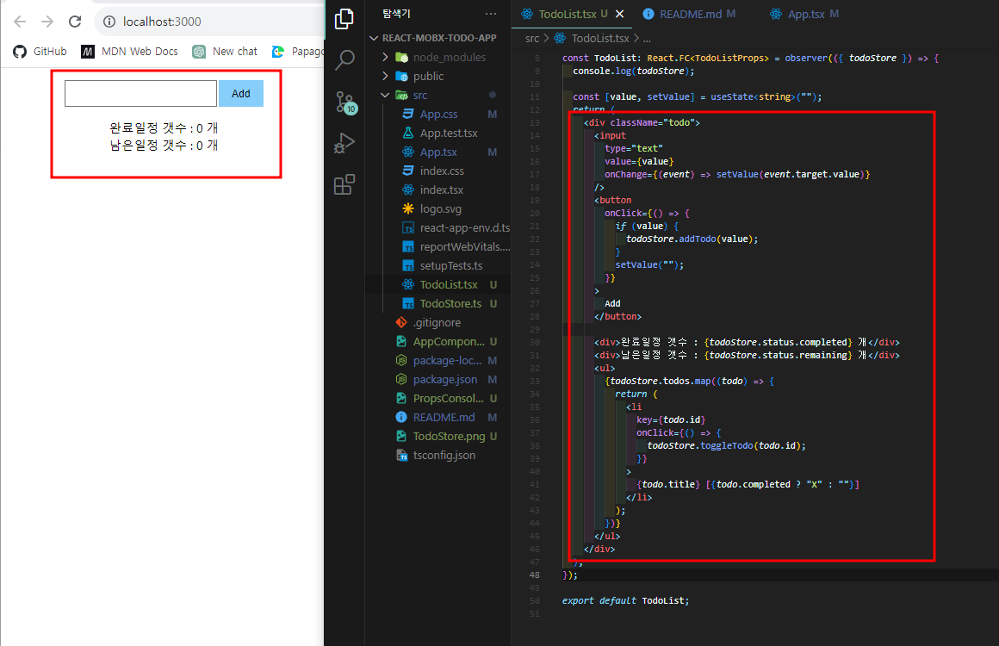
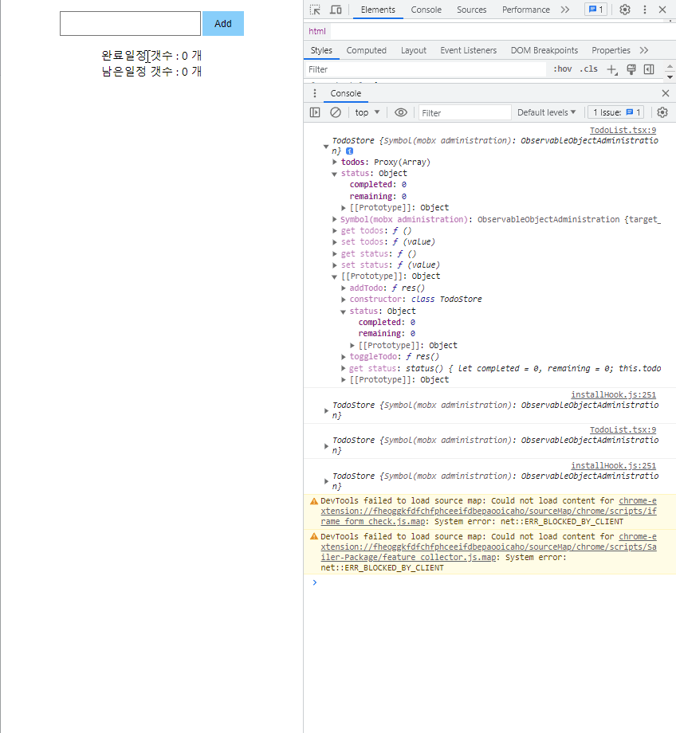

# MobX로 간단한 TodoList App 개발

TypeScript 템플릿을 사용하여 간단한 TodoList 개발연습

### 📌 개발 언어

>  
> 
> 

### MobX 사용순서 및 내용 정리

1. class문법으로 TodoStore생성
   

2. 최상위 컴포넌트에 Import 및 하위 컴포넌트 Props 전달
   

3. Props 전달받은 값 확인 시 Store에 정의되어있는 객체, 함수 등 확인하고 사용할 수 있다.  
   

4. 전달받은 Store를 활용한 실제 간단한 UI 구성
   

5. 동작  
   
